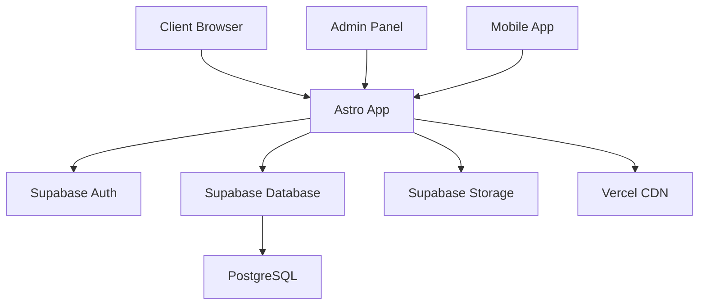
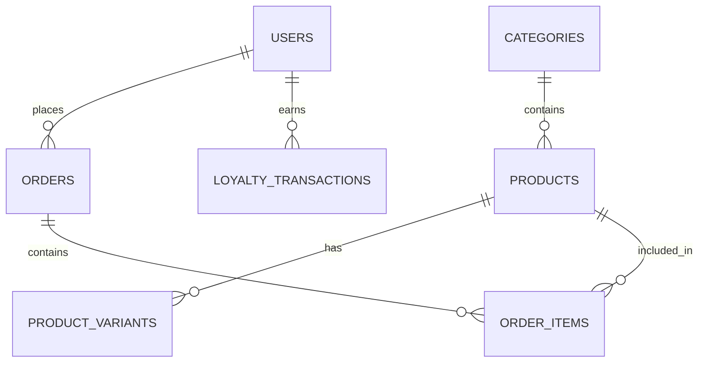

# 🍣 Osushi - Restaurant de Sushi en Ligne

> Application web moderne pour restaurant de sushi avec système de commande en ligne, gestion de fidélité et interface d'administration.

[](https://github.com/zatchoulisushi/sushi/actions)
[](https://vercel.com)
[](https://www.typescriptlang.org/)
[](https://astro.build)

## 📋 Table des matières

- [🎯 À propos du projet](#-à-propos-du-projet)
- [✨ Fonctionnalités](#-fonctionnalités)
- [🛠 Stack technique](#-stack-technique)
- [🚀 Installation](#-installation)
- [⚙️ Configuration](#️-configuration)
- [🔧 Développement](#-développement)
- [🧪 Tests](#-tests)
- [📦 Déploiement](#-déploiement)
- [🏗 Architecture](#-architecture)
- [🔐 Sécurité](#-sécurité)
- [📈 Performance](#-performance)
- [🤝 Contribution](#-contribution)
- [📚 Documentation](#-documentation)
- [❓ FAQ](#-faq)
- [📞 Support](#-support)

## 🎯 À propos du projet

**Osushi** est une application web complète pour restaurant de sushi permettant :

- **Commande en ligne** : Consultation du menu et commande avec livraison/emporter
- **Gestion des clients** : Authentification, profils et historique des commandes
- **Système de fidélité** : Points de fidélité avec niveaux (Bronze, Silver, Gold, Platinum)
- **Interface d'administration** : Gestion des commandes, produits et clients
- **Expérience optimisée** : Interface responsive avec mode sombre

### 🎨 Aperçu


*Page d'accueil avec navigation intuitive*


*Interface de consultation du menu par catégories*

## ✨ Fonctionnalités

### 🍱 Côté Client
- ✅ **Catalogue produits** : Navigation par catégories (Sashimi, Nigiri, Maki, etc.)
- ✅ **Variantes produits** : Différentes tailles et options
- ✅ **Panier intelligent** : Gestion locale avec persistance
- ✅ **Système de commande** : Sur place, emporter ou livraison
- ✅ **Authentification** : Inscription/connexion sécurisée
- ✅ **Profil utilisateur** : Informations personnelles et adresses
- ✅ **Historique** : Consultation des commandes passées
- ✅ **Programme de fidélité** : Accumulation et utilisation de points

### 👨‍💼 Côté Administration
- ✅ **Dashboard** : Vue d'ensemble des commandes et statistiques
- ✅ **Gestion produits** : CRUD complet des produits et catégories
- ✅ **Suivi commandes** : Workflow de traitement en temps réel
- ✅ **Gestion clients** : Profils et historique de fidélité
- ✅ **Paramètres** : Configuration horaires, zones de livraison

### 🎨 Interface Utilisateur
- ✅ **Design responsive** : Optimisé mobile, tablette et desktop
- ✅ **Mode sombre/clair** : Basculement automatique ou manuel
- ✅ **Animations fluides** : Transitions CSS optimisées
- ✅ **Accessibilité** : Respect des standards WCAG 2.1
- ✅ **Performance** : Optimisations Astro (SSG + hydratation sélective)

## 🛠 Stack technique

### Frontend
- **[Astro 5.x](https://astro.build)** - Framework web moderne avec SSG
- **[TypeScript](https://www.typescriptlang.org/)** - Typage statique JavaScript
- **[Tailwind CSS](https://tailwindcss.com/)** - Framework CSS utility-first
- **[Lucide Icons](https://lucide.dev/)** - Icônes SVG optimisées

### Backend & Database
- **[Supabase](https://supabase.com/)** - BaaS avec PostgreSQL, Auth et Storage
- **[PostgreSQL](https://www.postgresql.org/)** - Base de données relationnelle
- **[Row Level Security](https://supabase.com/docs/guides/auth/row-level-security)** - Sécurité au niveau des lignes

### Outils de développement
- **[Vite](https://vitejs.dev/)** - Build tool et dev server
- **[ESLint](https://eslint.org/)** - Linting JavaScript/TypeScript
- **[Prettier](https://prettier.io/)** - Formatage de code
- **[Vitest](https://vitest.dev/)** - Framework de tests unitaires
- **[Playwright](https://playwright.dev/)** - Tests end-to-end

### Déploiement & CI/CD
- **[Vercel](https://vercel.com/)** - Plateforme de déploiement
- **[GitHub Actions](https://github.com/features/actions)** - CI/CD automatisé

## 🚀 Installation

### Prérequis

- **Node.js** 18+ ([Télécharger](https://nodejs.org/))
- **npm** 9+ (inclus avec Node.js)
- **Git** ([Télécharger](https://git-scm.com/))
- **Compte Supabase** ([Créer un compte](https://supabase.com/))

### Installation locale

```bash
# 1. Cloner le repository
git clone https://github.com/zatchoulisushi/sushi.git
cd sushi

# 2. Installer les dépendances
npm install

# 3. Copier le fichier d'environnement
cp .env-example .env

# 4. Configurer les variables d'environnement (voir section Configuration)
nano .env

# 5. Lancer le serveur de développement
npm run dev
```

L'application sera accessible sur `http://localhost:4321`.

### Installation avec Docker (optionnel)

```bash
# Construire l'image
docker build -t osushi .

# Lancer le conteneur
docker run -p 4321:4321 osushi
```

## ⚙️ Configuration

### Variables d'environnement

Créez un fichier `.env` à la racine du projet :

```env
# Supabase Configuration
VITE_SUPABASE_URL=your_supabase_project_url
VITE_SUPABASE_ANON_KEY=your_supabase_anon_key
SUPABASE_SERVICE_ROLE_KEY=your_service_role_key

# App Configuration
VITE_APP_URL=http://localhost:4321
VITE_RESTAURANT_NAME=Osushi
VITE_RESTAURANT_PHONE=01 23 45 67 89
VITE_RESTAURANT_EMAIL=contact@osushi.fr

# Environment
NODE_ENV=development
```

### Configuration Supabase

#### 1. Créer un projet Supabase

1. Allez sur [supabase.com](https://supabase.com)
2. Créez un nouveau projet
3. Notez l'URL et les clés d'API

#### 2. Configurer la base de données

```bash
# Installer Supabase CLI
npm install -g supabase

# Se connecter à votre projet
supabase login
supabase link --project-ref your-project-id

# Appliquer les migrations
supabase db push
```

#### 3. Configurer l'authentification

Dans le dashboard Supabase > Authentication > Settings :

- **Site URL** : `http://localhost:4321`
- **Redirect URLs** : `http://localhost:4321/auth/callback`

#### 4. Configurer le stockage (optionnel)

Pour les images de produits :

```sql
-- Créer un bucket public pour les images
INSERT INTO storage.buckets (id, name, public)
VALUES ('product-images', 'product-images', true);

-- Politique d'accès en lecture
CREATE POLICY "Public Access" ON storage.objects FOR SELECT USING (bucket_id = 'product-images');
```

### Configuration Vercel (Production)

#### Variables d'environnement de production

Dans le dashboard Vercel :

```env
VITE_SUPABASE_URL=your_production_supabase_url
VITE_SUPABASE_ANON_KEY=your_production_anon_key
VITE_APP_URL=https://your-domain.vercel.app
```

## 🔧 Développement

### Scripts disponibles

```bash
# Développement
npm run dev              # Serveur de développement
npm run preview          # Prévisualisation du build
npm run build            # Build de production

# Qualité de code
npm run lint             # Linter ESLint
npm run format           # Formatage Prettier
npm run type-check       # Vérification TypeScript

# Tests
npm run test             # Tests unitaires
npm run test:watch       # Tests en mode watch
npm run test:ui          # Interface de test Vitest
npm run test:e2e         # Tests end-to-end
```

### Structure du projet

```
src/
├── components/          # Composants réutilisables
│   ├── auth/           # Composants d'authentification
│   ├── cart/           # Composants du panier
│   ├── products/       # Composants produits
│   └── admin/          # Composants d'administration
├── layouts/            # Layouts de page
├── pages/              # Pages Astro (routes)
│   ├── admin/         # Pages d'administration
│   └── auth/          # Pages d'authentification
├── lib/               # Services et utilitaires
│   ├── auth.ts        # Service d'authentification
│   ├── products.ts    # Service de gestion produits
│   ├── cart.ts        # Service de gestion panier
│   ├── orders.ts      # Service de gestion commandes
│   └── supabase.ts    # Configuration Supabase
├── assets/            # Assets statiques
└── test/              # Tests unitaires
```

### Workflow de développement

1. **Créer une branche feature**
   ```bash
   git checkout -b feature/nouvelle-fonctionnalite
   ```

2. **Développer avec hot reload**
   ```bash
   npm run dev
   ```

3. **Tester votre code**
   ```bash
   npm run lint
   npm run test
   npm run type-check
   ```

4. **Committer vos changements**
   ```bash
   git add .
   git commit -m "feat: ajouter nouvelle fonctionnalité"
   ```

5. **Pousser et créer une PR**
   ```bash
   git push origin feature/nouvelle-fonctionnalite
   ```

### Standards de code

#### TypeScript
- Utiliser les types stricts
- Éviter `any`, préférer les types appropriés
- Documenter les interfaces publiques

#### CSS/Tailwind
- Utiliser les classes Tailwind en priorité
- CSS custom uniquement si nécessaire
- Respecter le système de design

#### Composants Astro
- Un composant par fichier
- Props typées avec TypeScript
- Documentation JSDoc pour les props

## 🧪 Tests

### Tests unitaires

Les tests unitaires couvrent la logique métier :

```bash
# Lancer tous les tests
npm run test

# Tests en mode watch
npm run test:watch

# Tests avec couverture
npm run test -- --coverage

# Interface graphique
npm run test:ui
```

#### Exemple de test

```typescript
// src/test/cart.test.ts
import { describe, it, expect } from 'vitest';
import { CartService } from '../lib/cart';

describe('CartService', () => {
  it('should add item to cart', () => {
    const product = mockProduct;
    const cart = CartService.addItem(product, undefined, 2);
    
    expect(cart.items).toHaveLength(1);
    expect(cart.items[0].quantity).toBe(2);
  });
});
```

### Tests end-to-end

Les tests E2E valident le parcours utilisateur complet :

```bash
# Installer les navigateurs
npx playwright install

# Lancer les tests E2E
npm run test:e2e

# Tests E2E en mode debug
npm run test:e2e -- --debug

# Tests sur un navigateur spécifique
npm run test:e2e -- --project=chromium
```

#### Exemple de test E2E

```typescript
// tests/e2e/order.spec.ts
import { test, expect } from '@playwright/test';

test('should complete order flow', async ({ page }) => {
  await page.goto('/');
  
  // Ajouter un produit au panier
  await page.click('[data-testid="add-to-cart"]:first-child');
  
  // Vérifier le panier
  await expect(page.locator('[data-testid="cart-count"]')).toContainText('1');
  
  // Procéder au checkout
  await page.click('[data-testid="checkout-button"]');
  
  // Remplir les informations
  await page.fill('[name="email"]', 'test@example.com');
  await page.fill('[name="phone"]', '0123456789');
  
  // Confirmer la commande
  await page.click('[data-testid="confirm-order"]');
  
  // Vérifier la confirmation
  await expect(page.locator('.order-confirmation')).toBeVisible();
});
```

### Tests d'intégration

Tests avec Supabase en local :

```bash
# Démarrer Supabase local
supabase start

# Lancer les tests d'intégration
npm run test:integration
```

## 📦 Déploiement

### Déploiement automatique (Recommandé)

Le déploiement est automatisé via GitHub Actions :

1. **Push sur `develop`** → Déploiement staging
2. **Push sur `main`** → Déploiement production

### Configuration GitHub Secrets

Dans votre repository GitHub > Settings > Secrets :

```env
# Vercel
VERCEL_TOKEN=your_vercel_token
VERCEL_ORG_ID=your_organization_id
VERCEL_PROJECT_ID=your_project_id

# Supabase Staging
STAGING_SUPABASE_URL=your_staging_url
STAGING_SUPABASE_ANON_KEY=your_staging_key

# Supabase Production
PROD_SUPABASE_URL=your_production_url
PROD_SUPABASE_ANON_KEY=your_production_key
```

### Déploiement manuel

#### Sur Vercel

```bash
# Installer Vercel CLI
npm i -g vercel

# Déployer
vercel --prod

# Ou via npm script
npm run deploy
```

#### Sur Netlify

```bash
# Build
npm run build

# Déployer le dossier dist/
netlify deploy --prod --dir=dist
```

### Vérifications post-déploiement

1. ✅ Site accessible
2. ✅ Authentification fonctionne
3. ✅ Base de données connectée
4. ✅ Commandes peuvent être créées
5. ✅ Interface admin accessible

## 🏗 Architecture

### Vue d'ensemble



### Services

#### AuthService
Gestion de l'authentification et des profils utilisateur.

```typescript
// Exemple d'utilisation
const user = await AuthService.signUp(email, password, userData);
const profile = await AuthService.getUserProfile(userId);
```

#### ProductService
Gestion du catalogue produits et catégories.

```typescript
// Exemple d'utilisation
const categories = await ProductService.getCategories();
const products = await ProductService.getProducts(categoryId);
```

#### CartService
Gestion du panier en localStorage avec persistance.

```typescript
// Exemple d'utilisation
CartService.addItem(product, variantId, quantity);
const cart = CartService.getCart();
```

#### OrderService
Gestion des commandes et du système de fidélité.

```typescript
// Exemple d'utilisation
const order = await OrderService.createOrder(orderData);
const orders = await OrderService.getUserOrders(userId);
```

### Base de données

#### Schéma principal

```sql
-- Tables principales
users              -- Profils utilisateurs
categories          -- Catégories de produits
products           -- Produits du menu
product_variants   -- Variantes de produits
orders             -- Commandes
order_items        -- Articles dans les commandes
loyalty_transactions -- Historique fidélité
restaurant_settings -- Configuration
```

#### Relations



### Sécurité Row Level Security (RLS)

```sql
-- Exemple de politique RLS
CREATE POLICY "Users can view own orders" ON orders
  FOR SELECT TO authenticated
  USING (auth.uid() = user_id);

CREATE POLICY "Products are viewable by everyone" ON products
  FOR SELECT TO anon, authenticated
  USING (is_available = true);
```

## 🔐 Sécurité

### Authentification

- **Supabase Auth** : Gestion sécurisée des utilisateurs
- **JWT Tokens** : Authentification basée sur des tokens
- **Password Hashing** : Bcrypt avec salt automatique
- **Email Verification** : Vérification obligatoire des emails

### Autorisation

- **Row Level Security** : Contrôle d'accès au niveau des lignes
- **Rôles utilisateur** : Client, Admin, Super Admin
- **Scopes API** : Permissions granulaires

### Protection des données

- **HTTPS** : Communication chiffrée
- **Variables d'environnement** : Secrets non exposés
- **Validation côté serveur** : Validation de toutes les entrées
- **Sanitization** : Protection contre les injections

### Bonnes pratiques

```typescript
// Validation des entrées
const emailSchema = z.string().email();
const validatedEmail = emailSchema.parse(userInput);

// Gestion d'erreurs sécurisée
try {
  const user = await AuthService.signIn(email, password);
} catch (error) {
  // Ne pas exposer les détails d'erreur
  logger.error('Login failed', { email, error });
  throw new Error('Identifiants invalides');
}
```

## 📈 Performance

### Métriques cibles

- **First Contentful Paint** : < 1.5s
- **Largest Contentful Paint** : < 2.5s
- **First Input Delay** : < 100ms
- **Cumulative Layout Shift** : < 0.1

### Optimisations Astro

```astro
---
// Hydratation sélective
---
<Component client:load />      <!-- Hydratation immédiate -->
<Component client:idle />      <!-- Hydratation en différé -->
<Component client:visible />   <!-- Hydratation à la visibilité -->
```

### Optimisations images

```astro
---
import { Image } from 'astro:assets';
import heroImage from '../assets/hero.jpg';
---

<Image 
  src={heroImage} 
  alt="Hero image"
  loading="lazy"
  format="webp"
  quality={80}
/>
```

### Monitoring

- **Web Vitals** : Suivi automatique des métriques
- **Vercel Analytics** : Analyse de performance
- **Lighthouse CI** : Tests automatisés de performance

## 🤝 Contribution

### Comment contribuer

1. **Fork** le repository
2. **Créer** une branche feature (`git checkout -b feature/AmazingFeature`)
3. **Committer** vos changements (`git commit -m 'Add AmazingFeature'`)
4. **Pousser** vers la branche (`git push origin feature/AmazingFeature`)
5. **Ouvrir** une Pull Request

### Standards de contribution

#### Messages de commit

Suivre la convention [Conventional Commits](https://www.conventionalcommits.org/) :

```bash
feat: ajouter système de notification
fix: corriger bug du panier vide
docs: mettre à jour le README
style: formatter le code selon Prettier
refactor: restructurer le service auth
test: ajouter tests pour ProductService
chore: mettre à jour les dépendances
```

#### Pull Requests

- **Titre descriptif** : Résumer le changement en une ligne
- **Description détaillée** : Expliquer le contexte et les changements
- **Tests** : Inclure des tests pour les nouvelles fonctionnalités
- **Documentation** : Mettre à jour la documentation si nécessaire

#### Code Review

Critères de validation :

- ✅ Tous les tests passent
- ✅ Code formaté selon Prettier
- ✅ Pas de warnings ESLint
- ✅ Documentation mise à jour
- ✅ Performance non dégradée

### Reportage de bugs

Utiliser les [issues GitHub](https://github.com/zatchoulisushi/sushi/issues) avec :

1. **Titre clair** : Résumer le problème
2. **Description détaillée** : Étapes pour reproduire
3. **Environnement** : OS, navigateur, version Node.js
4. **Screenshots** : Si applicable
5. **Logs** : Messages d'erreur ou console

## 📚 Documentation

### Documentation technique

- **[API Reference](docs/api.md)** : Documentation des services
- **[Database Schema](docs/database.md)** : Schéma de base de données
- **[Components](docs/components.md)** : Guide des composants
- **[Deployment](docs/deployment.md)** : Guide de déploiement

### Tutoriels

- **[Getting Started](docs/getting-started.md)** : Premier pas avec le projet
- **[Adding Features](docs/adding-features.md)** : Ajouter des fonctionnalités
- **[Testing Guide](docs/testing.md)** : Guide des tests
- **[Troubleshooting](docs/troubleshooting.md)** : Résolution de problèmes

### Ressources externes

- **[Astro Documentation](https://docs.astro.build/)**
- **[Supabase Documentation](https://supabase.com/docs)**
- **[Tailwind CSS Documentation](https://tailwindcss.com/docs)**
- **[TypeScript Documentation](https://www.typescriptlang.org/docs/)**

## ❓ FAQ

### Questions fréquentes

**Q: Comment réinitialiser la base de données ?**
```bash
supabase db reset
npm run db:seed  # Réinsérer les données de test
```

**Q: L'authentification ne fonctionne pas en local**
- Vérifiez les variables d'environnement Supabase
- Confirmez l'URL de redirection dans le dashboard Supabase
- Vérifiez que RLS est bien configuré

**Q: Comment ajouter une nouvelle catégorie de produits ?**
```sql
INSERT INTO categories (name, description, image_url, sort_order)
VALUES ('Nouvelle Catégorie', 'Description', 'image.jpg', 10);
```

**Q: Comment débugger les erreurs de build ?**
```bash
npm run build -- --verbose
npm run type-check  # Vérifier les erreurs TypeScript
```

**Q: Comment optimiser les performances ?**
- Utiliser `client:visible` pour l'hydratation différée
- Compresser les images (WebP, formats modernes)
- Utiliser le lazy loading pour les images
- Minimiser les requêtes API

**Q: Comment configurer un domaine personnalisé ?**
1. Configurer le DNS pour pointer vers Vercel
2. Ajouter le domaine dans le dashboard Vercel
3. Mettre à jour `VITE_APP_URL` avec le nouveau domaine
4. Mettre à jour les URLs de redirection Supabase

### Problèmes courants

**Erreur: "supabaseUrl is required"**
- Solution : Vérifier le fichier `.env` et les variables Supabase

**Erreur: Build failed**
- Solution : Exécuter `npm run type-check` pour identifier les erreurs TypeScript

**Page blanche en production**
- Solution : Vérifier les variables d'environnement de production
- Vérifier les logs Vercel pour les erreurs

## 📞 Support

### Canaux de support

- **Issues GitHub** : [Créer une issue](https://github.com/zatchoulisushi/sushi/issues)
- **Discussions** : [GitHub Discussions](https://github.com/zatchoulisushi/sushi/discussions)
- **Email** : support@osushi.fr

### Niveaux de support

- **🐛 Bugs critiques** : Réponse sous 24h
- **🚀 Nouvelles fonctionnalités** : Réponse sous 72h
- **❓ Questions générales** : Réponse sous 1 semaine

### Ressources communautaires

- **Wiki** : [Documentation communautaire](https://github.com/zatchoulisushi/sushi/wiki)
- **Exemples** : [Dépôt d'exemples](https://github.com/zatchoulisushi/sushi-examples)

---

## 📄 Licence

Ce projet est sous licence MIT. Voir le fichier [LICENSE](LICENSE) pour plus de détails.

## 🙏 Remerciements

- **[Astro](https://astro.build)** pour le framework web moderne
- **[Supabase](https://supabase.com)** pour la stack backend complète
- **[Vercel](https://vercel.com)** pour la plateforme de déploiement
- **[Tailwind CSS](https://tailwindcss.com)** pour le framework CSS

---

**Fait avec ❤️ par l'équipe Osushi**

> 🍣 *"La perfection n'est pas atteignable, mais si nous poursuivons la perfection, nous pouvons atteindre l'excellence."*
